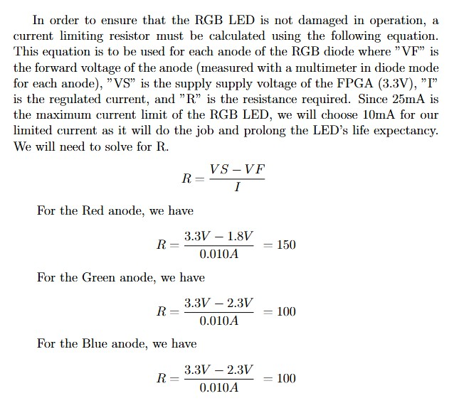
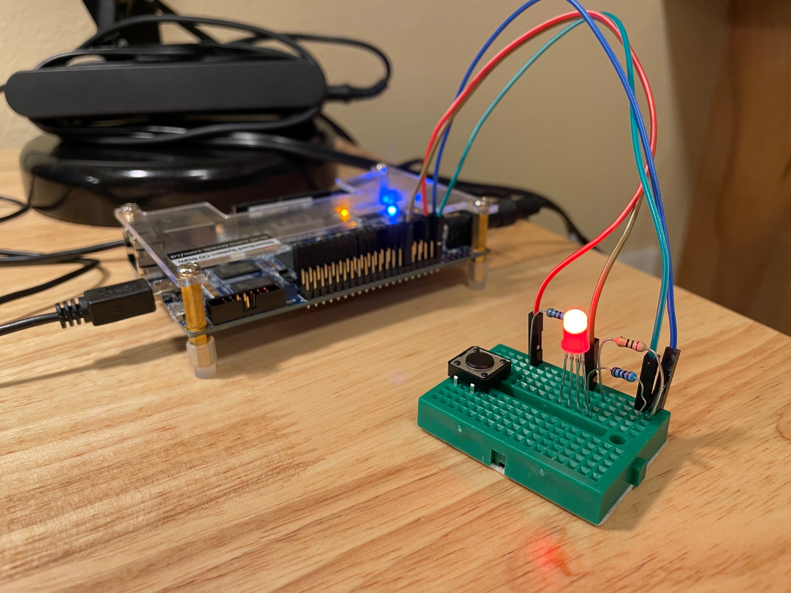
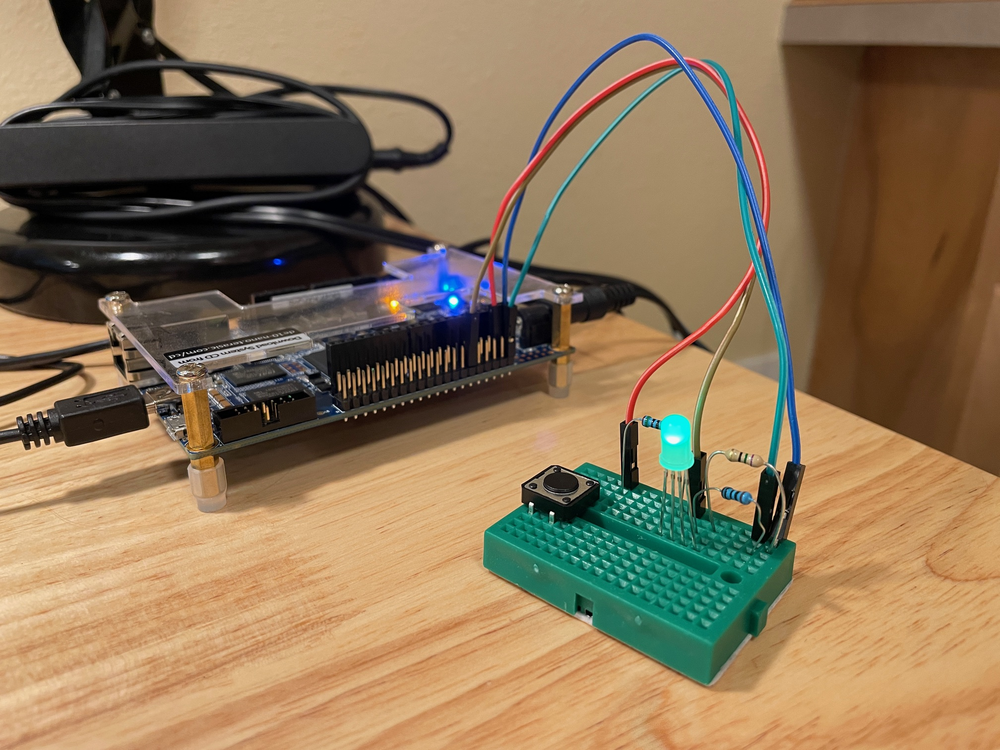
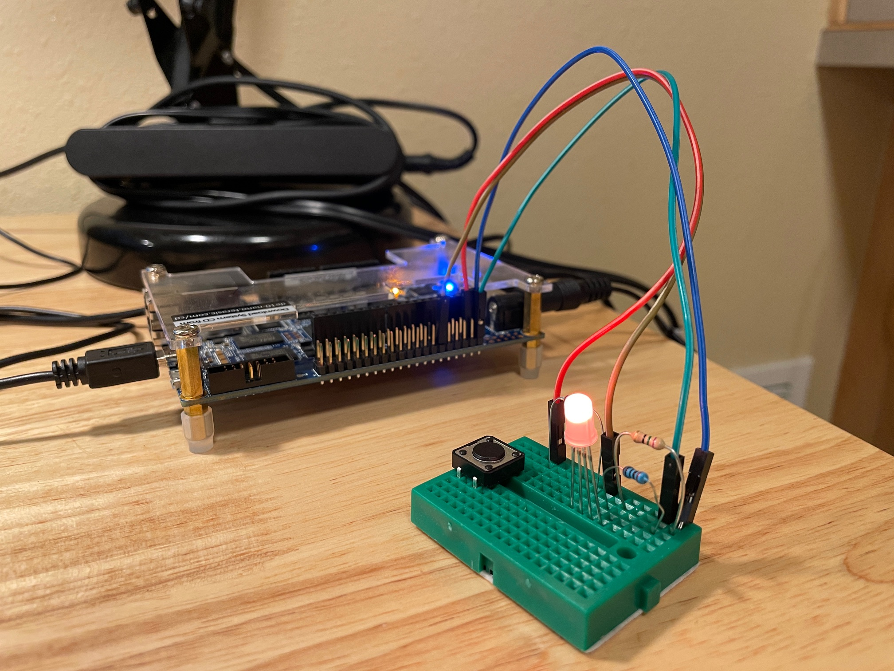

# HW10

## Overview
This homework is an exercise that involves creating another custom component in Quartus that can be controlled from a command line; this custom component controls . Like the led_patterns custom component, registers are mapped to the hdl and allow the user to access or control the module on the FPGA.

## Deliverables

### Resistance calculations 

### Pictures of LED states 

#### RED 

#### GREEN

#### BLUE

#### ORANGE

