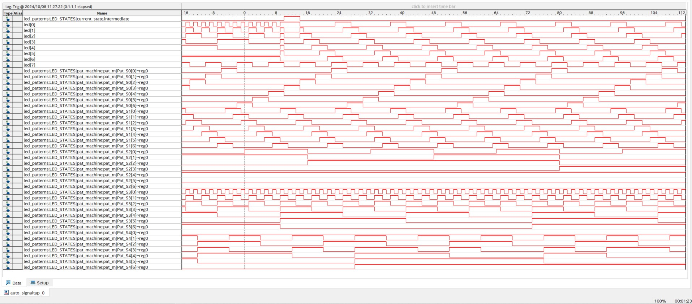

# LAB5

## Overview
This lab is an introduction to the signal tap function in quartus. We monitor the signals of our LED state machines from lab 4.

## Deliverables
Screenshot of waveforms

Screenshot of settings

### Questions 
"How much FPGA on-chip memory was required to monitor your signals?"

5632 bits
