# HW7

## Overview
We explored using different Linux commands in this HW

## Deliverables

### Problem 1
`$ wc lorem-ipsum.txt -w`

### Problem 2
`wc lorem-ipsum.txt -m`

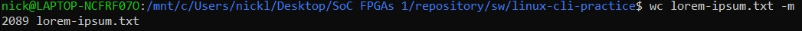
### Problem 3
` wc lorem-ipsum.txt -l`

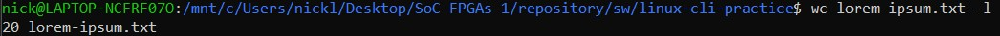
### Problem 4
`sort -n  file-sizes.txt`

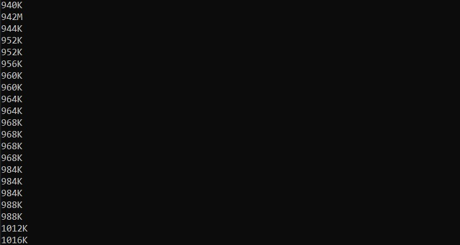
### Problem 5
`sort -r file-sizes.txt`

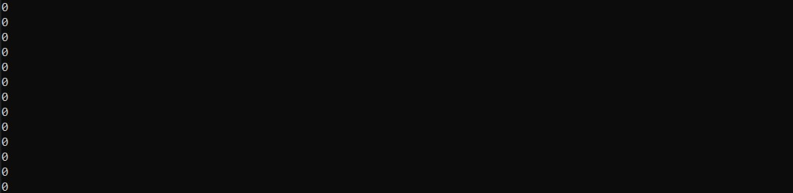
### Problem 6
`cut -f 3 -d "," log.csv`

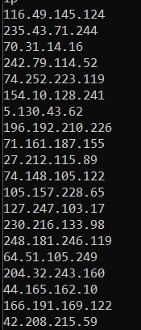
### Problem 7
`cut -d "," -f 2-3 log.csv`

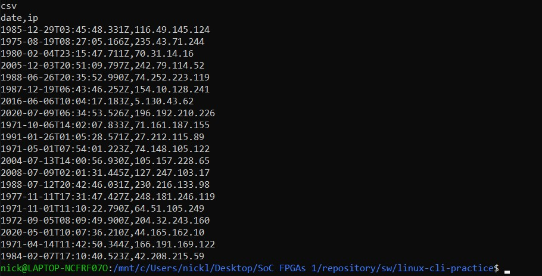
### Problem 8
`cut -d "," -f 1,4  log.csv`

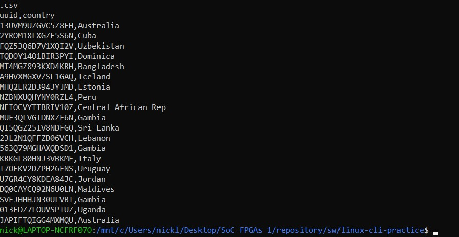
### Problem 9
`head -n -5 gibberish.txt`

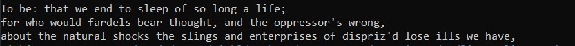
### Problem 10
` tail -n -2 gibberish.txt`

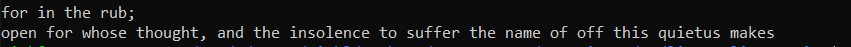
### Problem 11
` tail -n -20 log.csv`

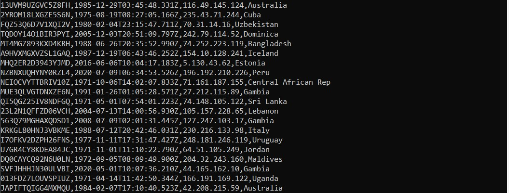
### Problem 12
`grep and gibberish.txt`

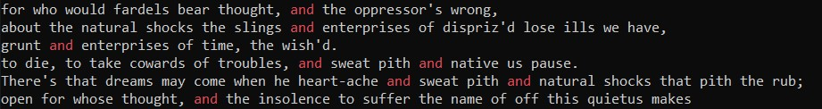
### Problem 13
`grep -o -n we gibberish.txt`

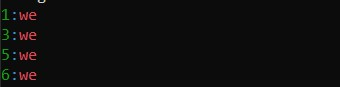
### Problem 14
`grep -P -o '[Tt]o \w+' gibberish.txt`

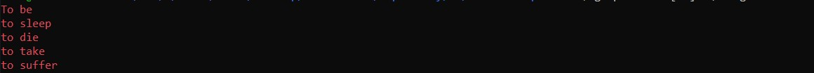
### Problem 15
`grep -c FPGAs fpgas.txt`

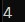
### Problem 16
`grep -P 'FPGAs are (hot|not)|Software engineers cower|Few have climbed the tower|Years gone by, nary a smile,|First d
esign to compile' fpgas.txt`

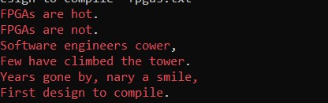
### Problem 17
`grep -r -c -P '\-\-' --include="*.vhd"`

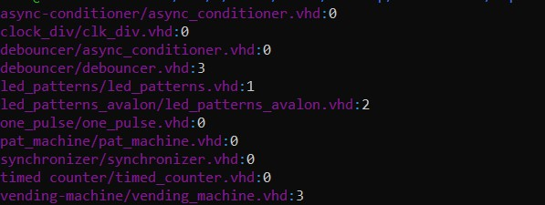
### Problem 18
`ls >ls-output.txt`
`cat ls-output.txt`

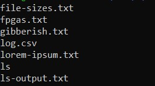
### Problem 19
`sudo dmesg | grep Mic`

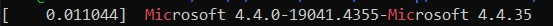
### Problem 20
`find -iname '*.vhd'|wc -l`

### Problem 21
`grep -r -P '\-\-' --include="*.vhd" hdl | wc -l`

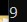
### Problem 22
`grep -n FPGAs fpgas.txt | cut -f 1 -d ':'`

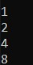
### Problem 23
`du -h * | sort -h`

