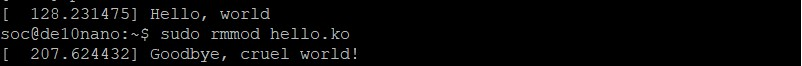
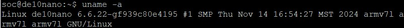
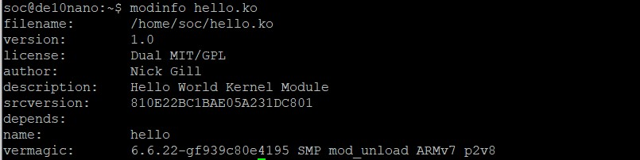

# Lab 8

## Overview
This lab investigates creating a device driver for the Linux kernel and putting it on a Linux Kernel within the FPGA.

## Deliverables

### Show “Hello world” and “Goodbye, cruel world” being printed in the kernel’s log buffer

### Use uname to show all of your system’s information (consult uname’s man page to figure out how to do this).

### Show the output of modinfo on your kernel module

