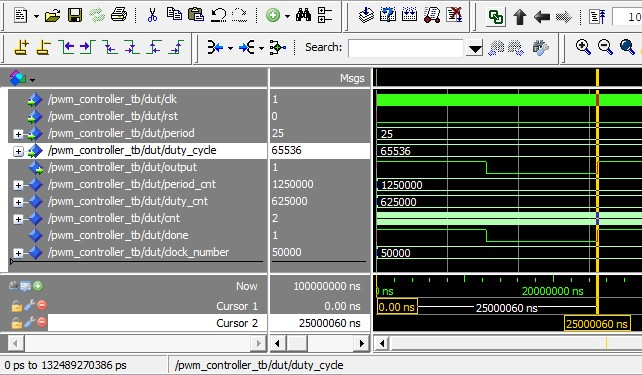

# HW9

## Overview
This lab looks at designing a PWM controller in VHDL. The file was first created in Modelsim, tested with a test bench, and then loaded onto the FPGA for verification. 

## Deliverables

### Screenshot of Testbench Simulation (25ms period, 50% duty cycle) 

### Screenshot of Testbench Simulation (10ms period, 93.75% duty cycle) 

### Oscilloscope Screenshot of 25ms period and 50% Duty Cycle measurements 
 

Note, the Analog Discovery 2 was used for this screenshot and shows the positive duty and period measurments on the right had side of the photo.