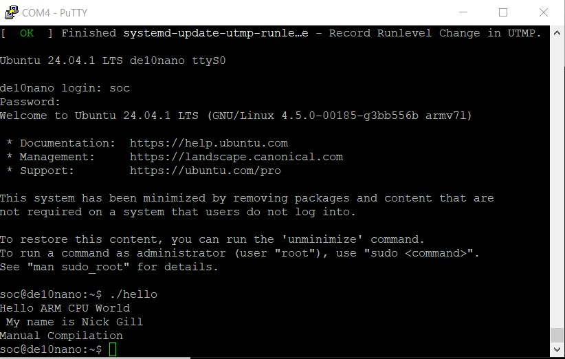

# LAB 3 

## Overview
Lab 3 investigates setting up the tftp server in our virtual machine to allow communication to the FPGA over the ethernet adapter. We compiled a hello.c program to work on the ARM processor architecture.

## Deliverables
Screenshot of hello.c running on Putty terminal. 

