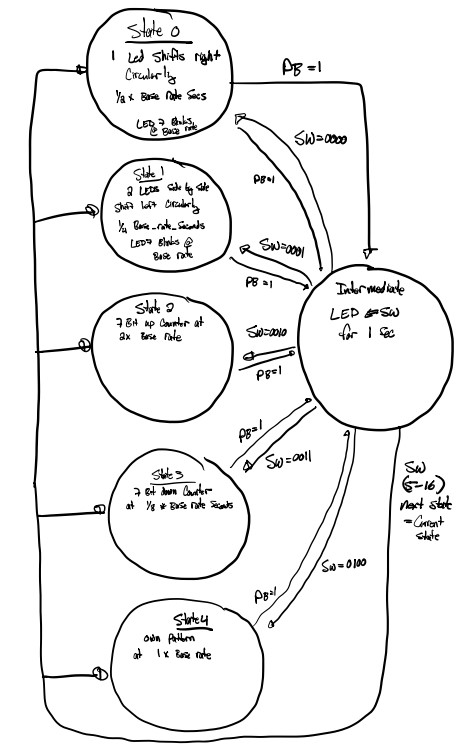

# Lab 4

## Project Overview
This lab aims to create an LED pattern generator with adjustable base period and external LED control with registers.

# Functional Requirements 
This program requires the user to program multiple LED pattern states. Each state is selectable with the DE10Nano's external switches. Four pattern states with the following bevaviors were needed.

State 0:
1 LED shifts right circularly at one half of the base rate in seconds. LED 7 blinks at the base rate as a comparison for timing. 

State 1: 
2 LEDS side by side shift left circularly at one fourth of the base period in seconds. LED7 blinks at the base rate as a timing comparison.

State 2:
The LEDS form a 7 BIT upcounter at 2 times the base rate. LED 7 Blinks at the base rate as a timing comparison. 

State 3: 
The LEDs for a 7 BIT downcounter at one eighth of the base rate in seconds. LED 7 Blinks at the base rate as a timing comparison.

State 4: 
This state is a custom pattern. This state performs unsigned subtraction of 6 for every clock cycle at one times the base rate in seconds. 

An intermediate state was also programmed. This state reads the input of the switches when a button is pressed and forwards their signals to the outputs of the LEDs. The switches are displayed for one second and if the switch combination is any value between 0 and 4, the machine will transition to the state specified by the switches. If the switch value falls outside of the range of the states (0 through 4) than the next state will be the state that was instantiated before the button press. 

## System Architecture

Figure 1 Shows the block diagram for the system. At the top level, the external interfaces of the DE-10 Nano are wired to the led_patterns state machine. This state machine serves as a multiplexer for the LED outputs. The push buttons are synchronized to the led_patterns component with the async_conditioner. Two other components were created within led_patterns: clk_div and pat_machine. clk_div creates different clocks that correspond to the varying base periods within the states described above. This component is wired to the pat_machine component, which uses these clocks to perform the various patterns of each state. When the pushbutton is pressed, the multiplexer in the led_patterns component reads the input of the switches and wires the LEDs to the appropriate output of the pat_machine pattern generator component. Figure 2 shows this functionality within a state diagram.

 ## Implimentation Details
 For the custom state, I hard coded an initial unsigned value of "1111010" to a subtractor pattern in the pat_machine component and subtracted 6 every time the clock changed at one times the base rate in seconds. 
