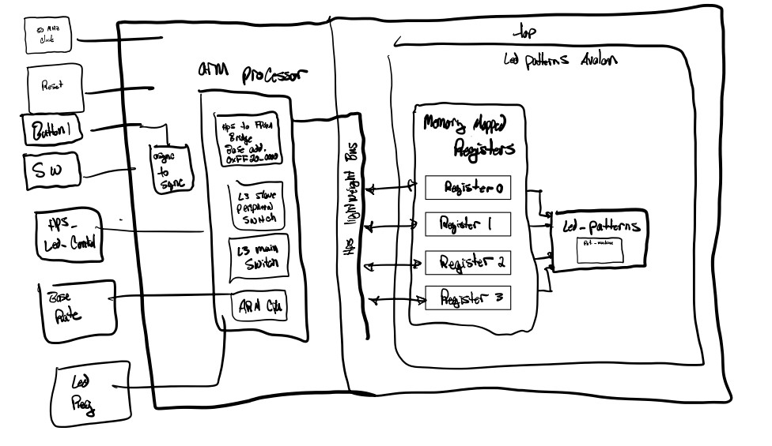
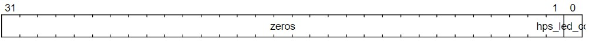

# Lab 6 

## Overview
Lab 6 is a tutorial on creating an avalon wrapper in Platform Designer in the the Quartus FPGA programmer suite.

## Deliverables

# System Architecture
First, an avalon related file must be created for our component that is to be wrapped. We are wrapping the led_patterns component in our project, so 
we created a file named "led_patterns_avalon". The purpose of this file is so that we are able to control parameters of our component externally with other
programs via registers. The architecture of this file creates a register selection system, as well as formats certain parameters of our component (signals like hps_led_control, leds, etc.)
into 32 bit vectors so that they can be interpreted as a register. Depending on the input to this system achritecture, the file will point to the appropriate register of the component so that 
the information can be read or written.

Here is a blco kdiagram of the wrapper within the top level file of our project.

# Register Map

The register is selected using the input port "avs_address", this is a 2 bit vector. Depending on the selections made on this input port, 
the following registers can be selected.

|Signal            | Register|
| --------         | ------- |
| hps_led_control  | 00      |
| base_period      | 01      |
| led_reg          | 10      |

The structure of each register is as follows.

hps_led_control

base_period

led_reg

### Questions 

##### 1. "How did you connect these registers to the ARM CPUs in the HPS?"

We created a switch in our top level file called "hps_led_control". The register system only works if this value is a 1. This essetially connects or disconnects the registers to the led_patterns_avalon component of the system. The registers are connected to the ARM CPU through the hps lightweight bus.

##### 2. "What is the base address of your component in your Platform Designer system?"

The custom component base address is 0x00004100. 

